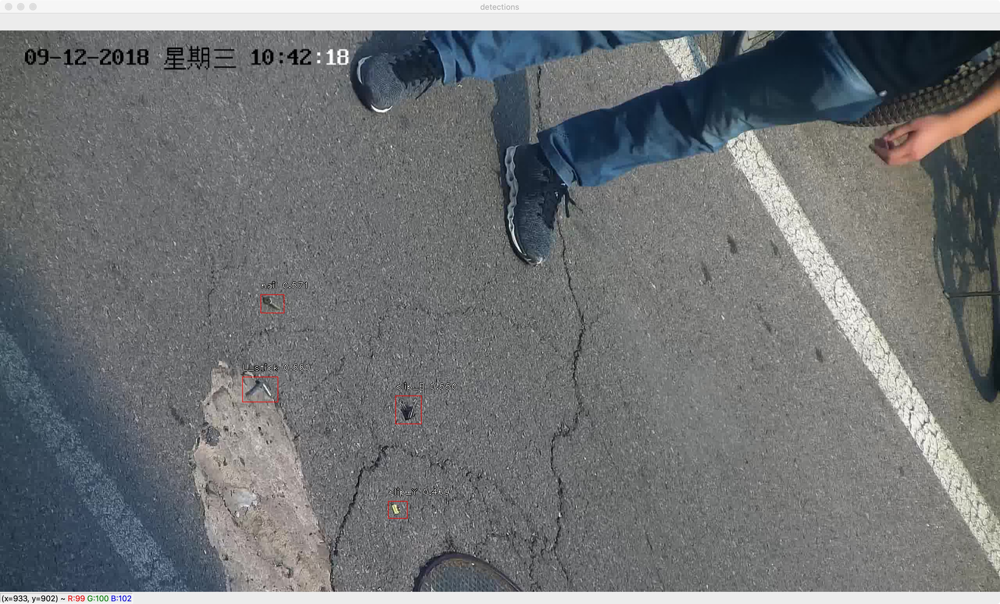
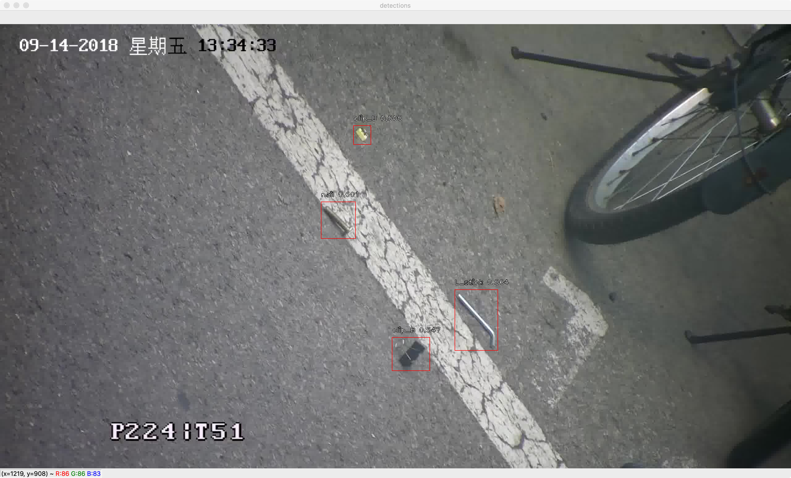
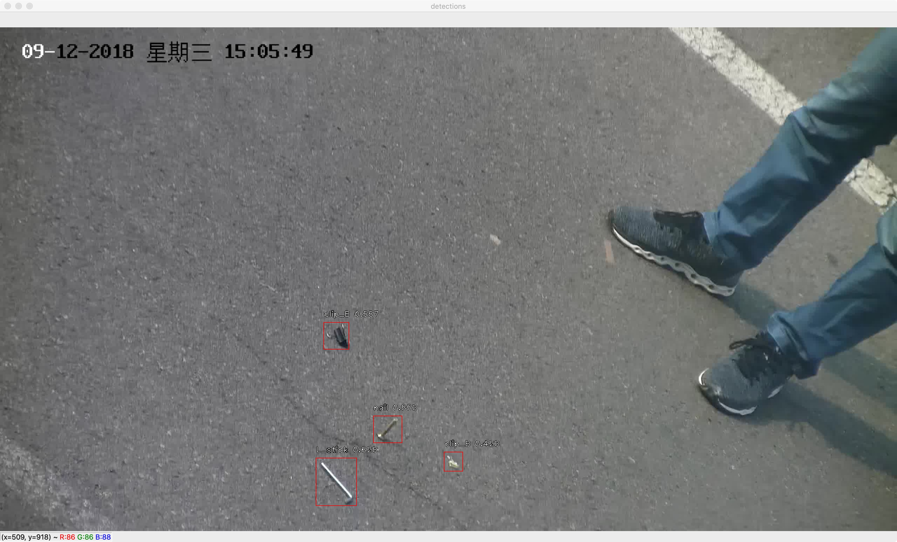
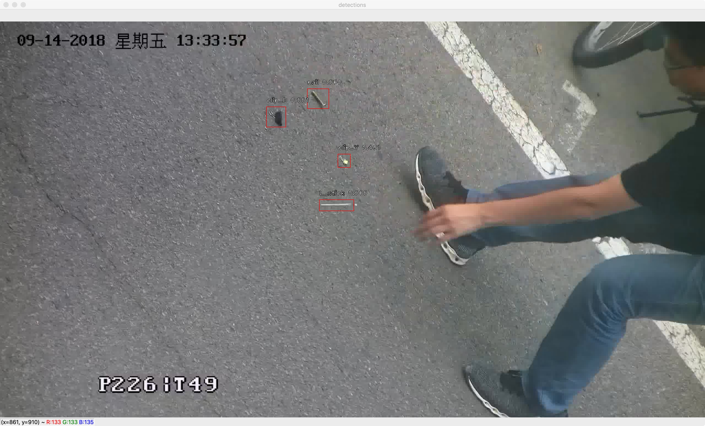

## FCOS: Pytorch Implementation Support PASCAL VOC
FCOS code which is similar with this repo: `https://github.com/zhenghao977/FCOS-PyTorch-37.2AP`

### Task Description

Given an input image, an algorithm is expected to produce a set of tight boxes around objects with classification labels. You can exploit various state-of-the-art methods or propose a novel method.

### Data Introduction

We provide 666 images, taken on the road at the Zhongguancun Campus. The foreign objects in the images include yellow/black clippers, screws and small wrenches for screwing. For example


###  AP Result

| 472 train images 922*1640 | total dataset 1440*2560 |
| :-----------: | :-----------------: |
|     **0.942(mAP)**     |      **TO DO**       |

### Requirements  
* opencv-python  
* pytorch >= 1.0  
* torchvision >= 0.4. 
* matplotlib
* cython
* numpy == 1.17
* Pillow
* tqdm
* pycocotools

### Results in dataset 

Trained on 2 Tesla-K80, 2 imgs for each gpu, init lr=1e-3 using GN, central sampling, GIou. 

Backbone is ResNet50. Pictures resize to 922*1640.

100 epochs, 472 train images, total training time is about 17 hours.

you can get the result as follows:
```python
all classes AP=====>
ap for nail is 0.9867446174307362
ap for clip_B is 0.923704170875592
ap for clip_Y is 0.872514426916056
ap for L_stick is 0.9869488167173289
mAP=====>0.942
```
And we also try to use RetinaNet on this task. But the result is not satisfactory.

My teammate guesses that the reason is that anchor free method has a great advantage over the anchor based method on a single scale, which the objects in this task are all similar in size.

The loss of FCOS hardly decreased after 30 epochs, and even if lr decreased in the later stage, the loss did not decrease further. This seems to indicate that FCOS converges very quickly. 

### There are some details you neet to notice:

> as for the data-augument, I only use flip, color jitter and rotate ,the random crop I also use for my training, but the ap is lower. So I suggest you turn off the random crop.

So do I.

> do NMS the scores needs to sqrt, which reference to the offical.

mei kan dong.

> the offical use BGR to training and pixel is not normalized to 0~1 , I use RGB and do the normalization.

```python
transforms.Normalize([0.485,0.456,0.406], [0.229,0.224,0.225],inplace=True)
```

This parameter is the same as my teammate's in RetinaNet. I am worried that this parameter may not be appropriate, but I did not modify it.

> I also use the cosine lr to train the voc, and it got 76.7mAP, which is lower than linear. I think the cosine lr matches Adam is better.

So I used SGD and manually adjust the learning rate. You can see how I did it in `train_voc.py`.

### Detect Image   
You can run the `detect.py` to detect images , `./test_images` provides samples from test set.









### Tips

1. `foreign_object_dataset` is almost the same data set as the VOC2007 format. And there are some redundant files for data preprocessing.

2. `dataset` is a dataloader for VOC2007. You can run VOC_dataset.py directly to test it.

3. `checkpoint`  is used to save intermediate results。

4. `detect.py` can perform object detection on the pictures in `test_images`, but I did not save the results.

5. Be careful of loss_inf. There is a good or bad news for you: the bug will appear from time to time.

```python
global_steps:1204 epoch:5 steps:208/249 cls_loss:1.0605 cnt_loss:0.7759 reg_loss:0.7620 cost_time:1950ms lr=1.9960e-03 total_loss:2.5985
global_steps:1205 epoch:5 steps:209/249 cls_loss:inf cnt_loss:0.3156 reg_loss:0.2938 cost_time:1461ms lr=1.9960e-03 total_loss:inf
global_steps:1206 epoch:5 steps:210/249 cls_loss:nan cnt_loss:nan reg_loss:nan cost_time:2443ms lr=1.9960e-03 total_loss:nan
global_steps:1207 epoch:5 steps:211/249 cls_loss:nan cnt_loss:nan reg_loss:nan cost_time:2005ms lr=1.9960e-03 total_loss:nan
```


