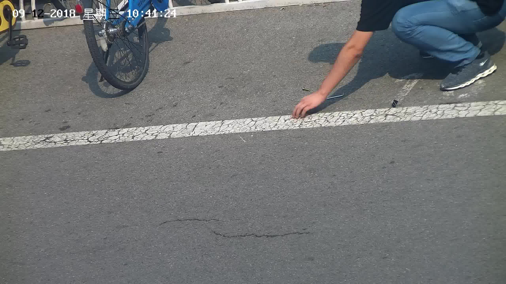

## FCOS: Pytorch Implementation Support PASCAL VOC
FCOS code which is similar with this repo: https://github.com/zhenghao977/FCOS-PyTorch-37.2AP

### Task Description

Given an input image, an algorithm is expected to produce a set of tight boxes around objects with classification labels. You can exploit various state-of-the-art methods or propose a novel method.

### Data Introduction

We provide 666 images as train dataset, taken on the road at the Zhongguancun Campus. The foreign objects in the images include yellow/black clippers, screws and small wrenches for screwing. For example



### Data Preprocessing

We noticed that the original data set has no category labels, only the position of the identification frame, and no identification of which category the object in the frame is. So we relabeled the data set and tagged all foreign objects.

There are five types of labels: nail，clip_B，clip_Y，L_stick and foreign. Foreign means some objects that are difficult to identify. The data set removed all the recognition boxes under the foreign label was used to train the model.

`foreign_object_dataset` is almost the same data set as the VOC2012 format. And there are some redundant files for data preprocessing.

We split the train dataset as train_set(contains 472 valid imgs, Some of the imgs do not contain valid target so they were ignored)  and val_set(contains 150 imgs). 

###  Final AP Result

| 472/150 train/val images 288*512 | 472/150 train/val images 922*1640 |
| :-----------: | :-----------------: |
|     **0.874(mAP)**     | **0.942(mAP)** |

### Requirements  
* opencv-python  
* pytorch >= 1.0  
* torchvision >= 0.4. 
* matplotlib
* cython
* numpy == 1.17
* Pillow
* tqdm
* pycocotools

### Results in dataset

The following are some parameters for FCOS training:

* Trained on 2 Tesla-K80, 2 imgs for each gpu, init lr=1e-3 using GN, central sampling, GIou. 

* Backbone is ResNet50. Pictures are resized to 922*1640.

* 100 epochs, 472 train images, total training time is about 17 hours.

* Evaluation criteria: Pascal VOC 2012 refer to https://github.com/jwyang/faster-rcnn.pytorch.

You can get the result as follows:

```python
all classes AP=====>
ap for nail is 0.9867446174307362
ap for clip_B is 0.923704170875592
ap for clip_Y is 0.872514426916056
ap for L_stick is 0.9869488167173289
mAP=====>0.942
```
The loss of FCOS hardly decreased after 30 epochs, and even if lr decreased in the later stage, the loss did not decrease further. This seems to indicate that FCOS converges very quickly. 

### Compared with RetinaNet

We also tried to use RetinaNet on this task. But the result was not satisfactory. The RetinaNet code has not been submitted together, you can see our RetinaNet code at this link https://github.com/esdolo/pytorch-retinanet.

Each members of our team implemented one model separately: RetinaNet and FCOS. We hoped to compare the performance of anchor-based and anchor-free methods.

The following are some parameters for RetinaNet training:

* Trained on 4 TITAN RTX, 2 imgs for each gpu, init lr=1e-5 with ReduceLROnPlateau:patience=3. 

* Backbone is ResNet18. Pictures are resized to 922*1640.

* 100 epochs, 472 train images, total training time is about 5 hours.

* Evaluation criteria: Pascal VOC 2012 as for FOCS.

And AP result:

```python
all classes AP=====>
ap for nail is 0.836699
ap for clip_B is 0.790292
ap for clip_Y is 0.744534
ap for L_stick is 0.911898
mAP=====>0.820856
```

So performance of retinanet is far behind FCOS. Notice that the depth of backbone of retinanet(18) and FCOS(50) differs, but we do not think this contributes too much for the performance gap. 

This gap is suprising but explable though. Many improvements adopted in FCOS like GN, centerness score, Scalar and GIou loss boosted FCOS a lot already in its original implementation and the sampling method of FCOS works better than that in retinanet.Those points are thoroughly discussed in [[3]](arxiv.org/abs/1912.02424), actually this paper is what drove us to FCOS.

More over, for this special task, the anchor-free style of FCOS also helps a lot, since the majority of the boxs in the images are too small(side lenth = 1/30 of the img width) to fit in the smallest ahchor used in retinanet , so we have to keep the image in a high resolution(922*1640 mentioned above) to ensure the anchors can work———that makes the model heavy and if we feed the retinanet with a lower resolution its performance will drop rapidly for sure. On the contrary, FCOS is much more rubust to the absolute scale change and outperforms retinanet given the parametres especially adjusted for retinanet.


### There are some details for FCOS:

> As for the data-augument, FCOS only use flip, color jitter and rotate ,the random crop I also use for my training, but the ap is lower. So I turned off the random crop finally.

> The offical use BGR to training and pixel is not normalized to 0~1 , I use RGB and do the normalization.

```python
transforms.Normalize([0.485,0.456,0.406], [0.229,0.224,0.225],inplace=True)
```

This parameter is the same as ours in RetinaNet. I am worried that this parameter may not be appropriate, but I did not modify it.

> I also use the cosine lr to train the voc, and it got 76.7mAP, which is lower than linear. I think the cosine lr matches Adam is better.

So the FCOS used SGD and manually adjust the learning rate. You can see how I did it in `train_voc.py`.

### Detect Image   
You can run the `detect.py` to detect images , `./test_images` provides samples from test set.

If you want to test our model, you need to make the following changes:

* Copy the test pictures to the `foreign_object_dataset/JPEGImages`.
* Copy the file name of the test files to `foreign_object_dataset/ImageSets/Segmentation/test.txt`, one per line, without extension, just like old data in that file.
* Finally run the `eval_voc.py`.


### Tips

1. `foreign_object_dataset` is almost the same data set as the VOC2012 format. And there are some redundant files for data preprocessing.

2. `dataset` is a dataloader for VOC2012. You can run VOC_dataset.py directly to test it.

3. `checkpoint`  is used to save intermediate results.

4. `detect.py` can perform object detection on the pictures in `test_images`, but I did not save the results.

5. Be careful of loss_inf. There is a good or bad news for you: the bug will appear from time to time.

```python
global_steps:1204 epoch:5 steps:208/249 cls_loss:1.0605 cnt_loss:0.7759 reg_loss:0.7620 cost_time:1950ms lr=1.9960e-03 total_loss:2.5985
global_steps:1205 epoch:5 steps:209/249 cls_loss:inf cnt_loss:0.3156 reg_loss:0.2938 cost_time:1461ms lr=1.9960e-03 total_loss:inf
global_steps:1206 epoch:5 steps:210/249 cls_loss:nan cnt_loss:nan reg_loss:nan cost_time:2443ms lr=1.9960e-03 total_loss:nan
global_steps:1207 epoch:5 steps:211/249 cls_loss:nan cnt_loss:nan reg_loss:nan cost_time:2005ms lr=1.9960e-03 total_loss:nan
```

### Reference
[1]Lin, T., Goyal, P., Girshick, R., He, K., & Dollar, P. (2020). Focal loss for dense object detection. *IEEE Transactions on Pattern Analysis and Machine Intelligence*, 42(2), 318-327. doi:10.1109/TPAMI.2018.2858826

[2]Tian, Z., Shen, C., Chen, H., & He, T. (2020). FCOS: A simple and strong anchor-free object detector. *IEEE Transactions on Pattern Analysis and Machine Intelligence, PP*, 1-1. doi:10.1109/TPAMI.2020.3032166

[3]Zhang, S., Chi, C., Yao, Y., Lei, Z., & Li, S. Z. (2019). Bridging the gap between anchor-based and anchor-free detection via adaptive training sample selection.
